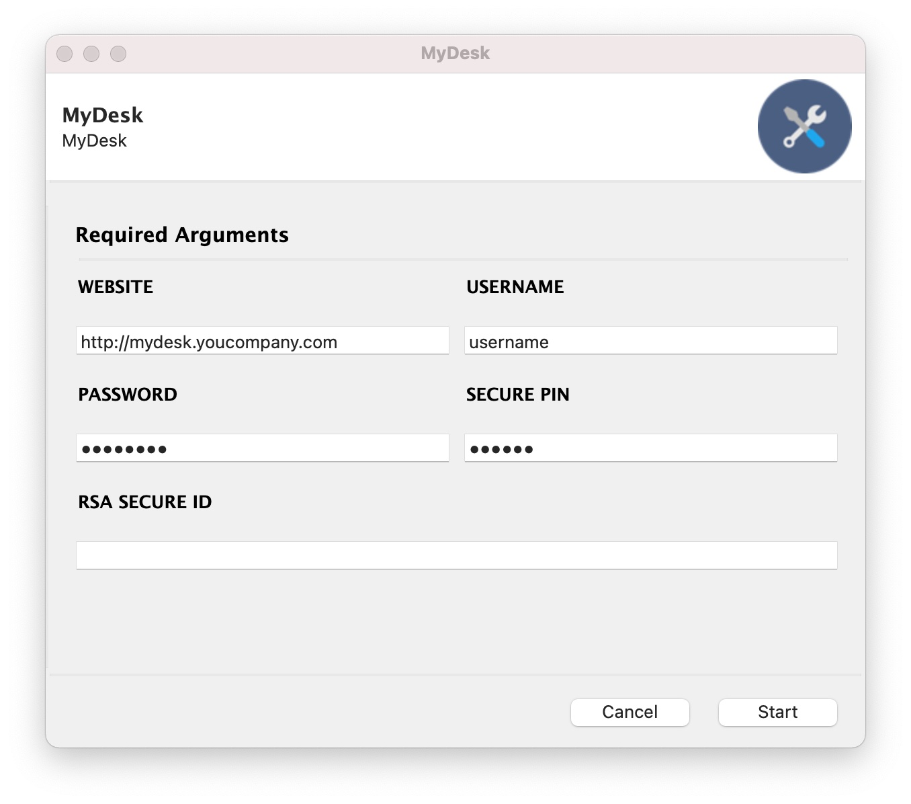

  
  
Dev
===

.. code-block:: shell

    CXXFLAGS="-I/opt/homebrew/include" pipenv install

    # this is because we need the latest pyinstaller for macOS M1 Silicon arm64 arch
    git clone --depth 1 https://github.com/pyinstaller/pyinstaller.git
    cd pyinstaller/bootloader
    python ./waf all
    cd ..
    pipenv run pip install .

    cp mydesk.ini ~/mydesk.ini (and also edit this file)
    mydesk

Release
=======

.. code-block:: shell

    ./pyinstaller.sh

Environment Variables
=====================

.. list-table:: Supported Environment Variables

    * - Name
      - Description
    * - MYDESK_CONFIG_FILE
      - Defaults to ~/mydesk.ini
